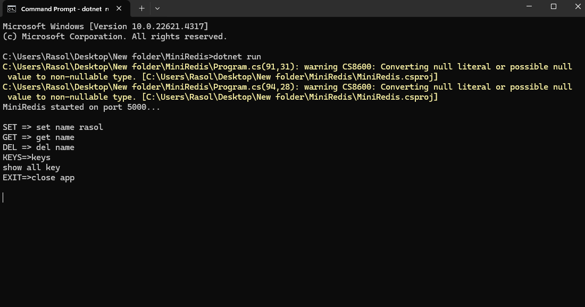
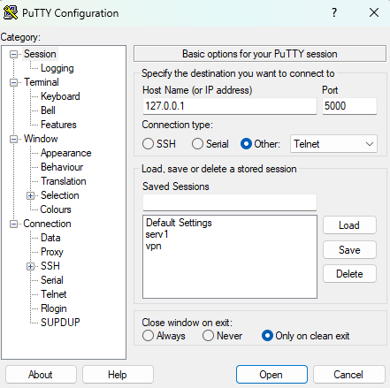
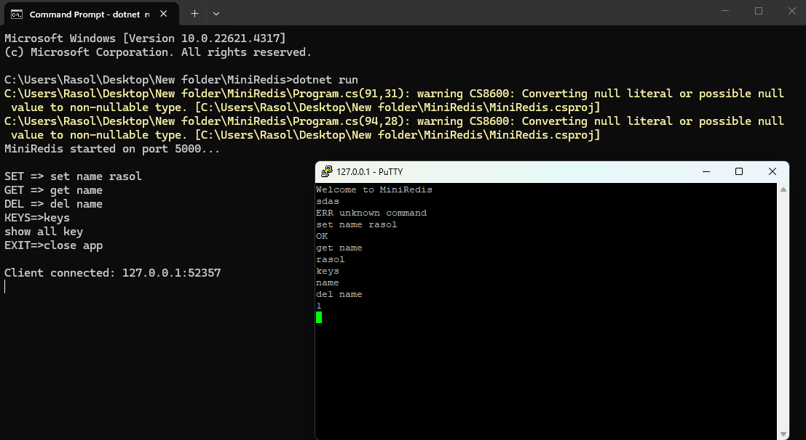

# MiniRedis

A tiny Redis-like TCP key-value server built with **C#**.  
MiniRedis is an educational project that demonstrates how to build a simple multi-client TCP server with in-memory storage.

---

## Features

- Multi-client TCP support
- In-memory key-value storage
- Thread-safe with `ConcurrentDictionary`
- Simple text-based protocol
- Easy to test with `telnet` or `netcat`

---

## Commands

| Command | Example | Description |
|--------|---------|-------------|
| `SET` | `SET name rasol` | Set a value for a key |
| `GET` | `GET name` | Get the value of a key |
| `DEL` | `DEL name` | Delete a key |
| `KEYS` | `KEYS` | List all keys |
| `EXIT` | `EXIT` | Close the connection |

---

 Quick Start

Run the server on the default port `5000`:

dotnet run

Connect to the server:

telnet 127.0.0.1 5000

or

Docker
Build the Docker image:
    docker build -t miniredis -f Dockerfile .
Run the container:
docker run -p 5000:5000 miniredis

Technical Notes
Built with TcpListener and TcpClient
Uses StreamReader and StreamWriter
StreamWriter is configured with AutoFlush = true
Uses ConcurrentDictionary<string, string> for storage
Each client is handled in its own task
Supports clean shutdown with CancellationTokenSource
Limitations
Data is stored only in memory
No authentication
No TTL support
Not RESP-compatible
Only string values are supported
Roadmap
Possible improvements:

Persistence support
TTL / expiration commands
RESP protocol support
PING command
Logging and tests